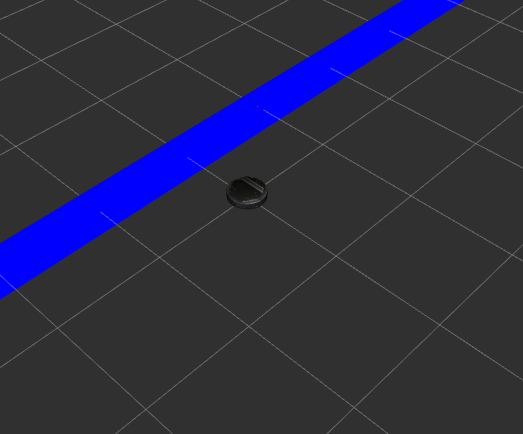
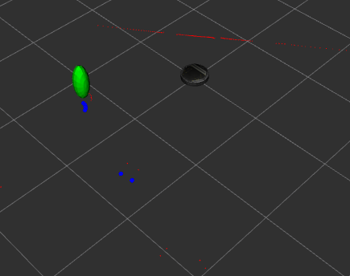
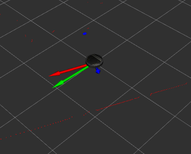

# Warmup Project 2017
Riley Chapman and Bonnie Ishiguro

Computational Robotics, Olin College of Engineering 

## Teleop
Goal: Control the linear and angular velocity of the robot using keyboard commands

The script interprets keyboard input, translates these commands to linear and angular velocity commands, and publishes a `Twist` message to the `/cmd_vel` ROS topic.

Since this script is not structured in an object-oriented way, it utilizes a few global variables to maintain consistency in values such as the maximum linear and angular velocity. 

## Driving in a Square
Goal: Drive the robot in a square, navigating based on location in the `odom` coordinate frame. 

At this point in the class, the `odom` coordinate frame is as close as we have to a "world" coordinate frame. We programed the robot to have two modes. The first mode controls the angle of the robot, used for turning in place at the corners of the square. The second mode drives the robot toward a target point. This decision to control the robot in the `odom` coordinate frame enables the robot to be robust to disturbances while driving in the square, as long as the disturbances are detected in the `odom` frame (i.e. overriding via tele-op).

The "turn in place" mode uses proportional control on the angular velocity by calculating the error in orientation between the angle the robot is facing, and some goal angle. This control scheme enables the robot to turn to any orientation in the `odom` coordinate frame. 

The "drive to point" mode utilized proportional control on both the angular and linear velocities. Angular velocity is controlled by the error in orientation found by taking the difference between the orientation of the robot and the direction the point is from the robot. Linear velocity (in the x direction of the robot's frame of reference, `base_link`) is controlled by the distance between the goal point and the robot. 

The robot controller switches between these two modes to alternate between turning in the direction of the next side, and driving along that side to the next corner. 

## Wall Following
Goal: Drive the robot parallel to any wall detected by its LIDAR scanner

To detect an existing wall, we read from two separate directions from the LIDAR scanner, 45 degrees apart.  We calculate the angle of the wall relative to the robot using the distances between these detected wall points and the robot.  The angular velocity is proportionally controlled by the difference between the orientation of the robot and the orientation of the wall.  This results in the robot orienting itself parallel to the wall.  We set a constant linear velocity so that it the robot will drive forward while orienting itself in this fashion.  To handle dropped scanner data, we only update the distance values from the LIDAR scanner when they are non-zero.

The major challenges of this part of the project included determining how to calculate the relative angle of the wall based on the distances returned from the LIDAR scanner.

## Person Following
Goal: Identify a nearby object likely to be a person, orient toward it, and drive to a specified distance away from it. 

First, the script needs to locate objects within a defined region in front of it. We filter out laser scan detections that are beyond a specified angle, beyond a specified distance in front of the robot, or are zero values. We then use a K-means clustering algorithm from SciKit-Learn, which takes in the filtered points, and returns the location of a specified number of clusters. We assume that the closest cluster to the robot is most likely to be a person, and we assume that if any laser scan detections are located in the region in front of the robot, then a person is present. 

Once we have determined the location of our goal, angular velocity is controlled by the error in orientation found by taking the difference between the orientation of the robot and the direction the goal point is from the robot. Linear velocity (in the x direction of the robot's frame of reference, `base_link`) is controlled by the distance between the goal point and the robot, with an offset so it does not run into the person. 

We found it useful to visualize the filtered points as well as the closest cluster while developing this behavior. These were published as markers to be visualized by RVIZ. The filtered points take the form of a list of spheres, while the "person" cluster takes the form of a spheroid. 

Our only method of differentiating between objects (i.e. walls, tables, garbage cans) and people is the location of clusters. If a wall is in the field of view, and is closer than a person in the field of view, then the robot will approach the wall. We discovered that if the K-means algorithm does not calculate enough clusters, then the person may be averaged with its surrounding objects. For example, the center of the cluster could be between a person and a nearby wall.

   

## Obstacle Avoidance
Goal: Navigate toward a goal point while avoiding any obstacles in its path.

First, we use the LIDAR sensor to detect any obstacles within a specified distance from the robot in all directions.  We use the distance of these laser scan points to calculate a repulsive force for each object in its view.  The magnitude of one of these forces is inversely proportional to its object's distance from the robot, as can be seen in the equation below:

`force = - 0.5 / distance^2`

These proportional forces are summed together to create a total repulsive force on the robot. We also determine an attractive force acting on the robot from a goal point specified in the `odom` coordinate frame. These two forces are then weighted by an "attraction proportion", which determines how much the robot cares about its goal relative to nearby obstacles. The weighted forces are then combined to form a final "drive force" acting on the robot. The angular and linear velocities of the robot are then proportionally controlled using the difference between the robot's orientation and the direction and magnitude of the "drive force". 

The filtered laser scan returns are visualized in RVIZ as a list of spheres. The weighted repulsive force, weighed attractive force, and resulting drive force are all visualized as arrows. The goal point is visualized as a red sphere. 

One difficult part of this implementation is tuning the relative weight of repulsion and attraction, combined with the function used to weight the magnitude of the repulsive forces based on distance. This form of implementation is not very good at avoiding obstacles that are directly between the robot and its goal point, since the repulsion and attraction directly cancel each other out.  

## Finite State Control
We implemented a finite state controller that changes between following a person and spinning in circles. Our person follower reports whether it believes it has detected a person or not, so we used this to change between states. If a person is detected, then the robot follows them, otherwise it spins in circles.

We modified the structure of our person following script to return a twist instead of publishing it directly. We also removed its initialization of a node since that clashed with the node of the finite state controller.  
